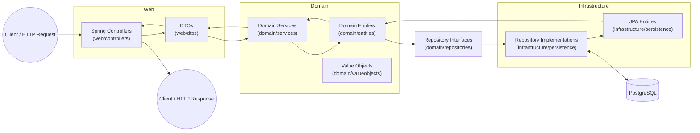
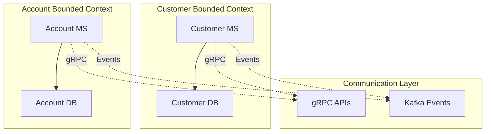
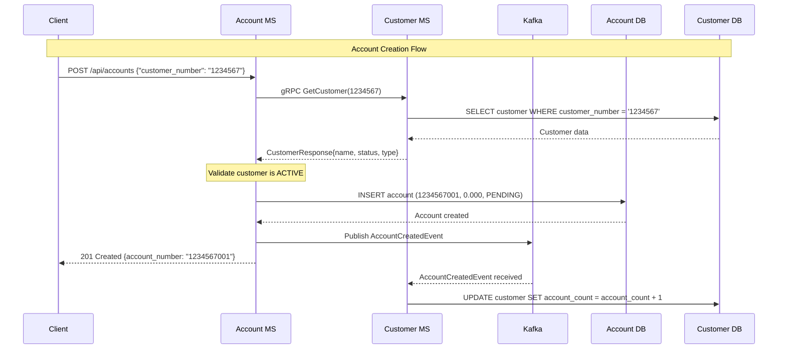

# Architecture

This is a microservice project and uses Domain-Driven Design (DDD) with a layered architecture pattern. This means we organize our code into parts that each have specific jobs, keeping business logic separate from technical details.

## TODO(aalhendi): Overview diagram... or at least a better one

We will begin with zooming in on a single service.

## How Data Flows

When a request comes in:

1. The **web** layer handles HTTP requests through Spring Boot controllers
2. **DTOs** in the web layer convert JSON to/from data structures  
3. **Domain services** in the domain layer contain business logic and rules
4. **Domain entities** in the domain layer enforce business invariants
5. **Repository interfaces** in the domain define how to store and retrieve data
6. **Repository implementations** in the infrastructure layer talk to the database
7. **JPA entities** in the infrastructure layer map between domain objects and database tables

Each layer only talks to the layers it needs to. The domain layer doesn't know about web or database details. This makes our code easier to test and change.



## Services and Inter-Service Communication



### Communication Patterns

Our microservices use **multiple communication patterns** depending on the use case:

#### 1. **Synchronous Communication: gRPC**

For real-time, critical operations requiring immediate consistency. gRPC fits the bill better that REST with type safety, bidirectional straming and better performance. Less bytes over the network is always better. This will most likely be the most encountered, primary mode for communication.

**Use Cases TODO(aalhendi): update as the codebase gets fleshed out**:

- Account creation validating customer exists
- Real-time balance checks during transactions
- Customer status verification for account operations.

Examples:

```protobuf
// customer-service.proto
service CustomerService {
  rpc GetCustomer(GetCustomerRequest) returns (CustomerResponse);
  rpc ValidateCustomer(ValidateCustomerRequest) returns (ValidationResponse);
}

message GetCustomerRequest {
  string customer_number = 1;
}

message CustomerResponse {
  string customer_number = 1;
  string name = 2;
  string customer_type = 3;
  string status = 4;
}
```

#### 2. **Asynchronous Communication: Kafka Events**

For eventual consistency and business event propagation.

**Use Cases TODO(aalhendi): update as the codebase gets fleshed out**:

- Customer creation → Account service creates default account
- Account status changes → Customer service updates customer record
- Audit logging and event sourcing
- Analytics and reporting

Examples:

```java
// Domain Events
public class CustomerCreatedEvent {
    private String customerNumber;
    private String customerType;
    private String status;
    private LocalDateTime occurredAt;
}

public class AccountCreatedEvent {
    private String accountNumber;
    private String customerNumber;
    private BigDecimal initialBalance;
    private LocalDateTime occurredAt;
}
```

#### 3. **Service Discovery & Load Balancing**

Using **Consul**

TODO(aalhendi): fill in when we have enabled and decided on consul behavior.

### 4. **Public API Endpoints**

For public endpoints exposed to clients, we opt for REST (as per the demo spec).

TODO(aalhendi): add examples later.

### Communication Flow Example



## Project Structure TODO(aalhendi): do we want to move this up? Maybe look into how this reads and flows

We split our code into 2 main microservices, each with 3 layers:

```text
angry-pufferfish/
├── account-ms/          # Account microservice
│   └── src/main/java/com/aalhendi/account_ms/
│       ├── domain/      # Business logic (entities, services, value objects)
│       ├── infrastructure/ # Database layer (JPA, repositories)
│       └── web/         # HTTP layer (controllers, DTOs)
├── customer-ms/         # Customer microservice (same structure)
└── docker-compose.yml   # Database setup
```

---

## What Each Layer Does

### 1. **Domain Layer**

- **What it contains**:
  - Value objects - small types with validation (AccountNumber, Balance)
  - Entities - the core business objects (Account, Customer)
  - Repository interfaces - contracts for data access
  - Services - where complex business rules live
  - Business rules and invariants

- **Rules**:
  - No web or database code here
  - Validate all data via value objects and entity methods
  - No external dependencies except basic Java
  - No serialization annotations (no `@JsonProperty`)

**Example**:

```java
// domain/entities/Account.java
public class Account {
    private final AccountNumber accountNumber;
    private Balance balance;
    private AccountStatus status;
    
    public static Account create(AccountNumber accountNumber) {
        return new Account(accountNumber, Balance.zero(), AccountStatus.PENDING);
    }
    
    public void credit(Balance amount) {
        validateTransactionPreconditions(); // TODO(aalhendi): probably opt for something like @Valdiate and have that impl an interface/trait which defines an abstract `validate()` function. that way we can just call validate everywhere and not worry about having tons of validateXPreconditions...
        this.balance = this.balance.add(amount);
    }
}
```

---

### 2. **Infrastructure Layer**

- **What it contains**:
  - JPA entities - structs that match database tables
  - Repository implementations - code that runs SQL
  - Database configuration and migrations
  - Conversion between domain and JPA entities

- **Rules**:
  - Never import from web layer
  - Convert between database and domain types
  - Keep SQL queries and JPA annotations here
  - Handle database-specific concerns

**Example**:

```java
// infrastructure/persistence/AccountEntity.java
@Entity
@Table(name = "account")
public class AccountEntity {
    @Id
    @GeneratedValue(strategy = GenerationType.IDENTITY)
    private Long id;
    
    @Column(name = "account_number", unique = true)
    private String accountNumber;
    
    public Account toDomain() {
        return Account.reconstitute(
            this.id,
            AccountNumber.of(this.accountNumber),
            Balance.of(this.balance),
            AccountStatus.fromCode(this.status)
        );
    }
}
```

---

### 3. **Web Layer**

- **What it contains**:
  - HTTP controllers and REST endpoints
  - Request and response DTOs
  - Error handling for HTTP
  - Input validation and serialization

- **Rules**:
  - Map domain entities to/from HTTP DTOs
  - Handle serialization/deserialization with Jackson
  - Convert domain errors to HTTP responses
  - No business logic here

**Example**:

```java
// web/dtos/CreateAccountRequest.java
public class CreateAccountRequest {
    @JsonProperty("customer_number")
    private String customerNumber;
    
    public String getCustomerNumber() {
        return customerNumber;
    }
}

// web/controllers/AccountController.java
@RestController
@RequestMapping("/api/accounts")
public class AccountController {
    
    @PostMapping
    public ResponseEntity<AccountResponse> createAccount(@RequestBody CreateAccountRequest request) {
        Account account = accountService.createAccount(request.getCustomerNumber());
        return ResponseEntity.ok(AccountResponse.from(account));
    }
}
```

---

## How It Works: Creating an Account

1. **HTTP Request**:

   ```json
   POST /api/accounts { "customer_number": "1234567" }
   ```

2. **Web Layer**:
   - Parse JSON into `CreateAccountRequest`
   - Extract customer number

   ```java
   String customerNumber = request.getCustomerNumber();
   ```

3. **Domain Layer**:
   - Service validates customer number format
   - Generate next available account number
   - Create domain entity with business rules

   ```java
   Account account = accountService.createAccount(customerNumber);
   ```

4. **Infrastructure Layer**:
   - Convert `Account` to `AccountEntity`
   - Run SQL to insert record
   - Convert DB record back to domain type

   ```java
   AccountEntity entity = AccountEntity.fromDomain(account);
   AccountEntity saved = jpaRepository.save(entity);
   return saved.toDomain();
   ```

5. **Response**:
   - Convert domain `Account` to `AccountResponse`
   - Return JSON

   ```json
   { "account_number": "1234567001", "balance": "0.000", "status": "PENDING" }
   ```

---

## Business Rules Enforced

TODO(aalhendi): do i want to keep business rules here in architecure or branch them out into a different file?

### Account Rules

- **Account Number Format**: 10 digits (7-digit customer + 3-digit serial)
- **Account Limit**: Maximum 10 accounts per customer
- **Serial Numbers**: Range from 001 to 010
- **Balance Precision**: Always 3 decimal places using BigDecimal
- **Status Transitions**: PENDING → ACTIVE → SUSPENDED/FROZEN → CLOSED

### Transaction Rules

- **Active Status Required**: Only ACTIVE accounts can perform transactions
- **Positive Amounts**: Credit/debit amounts must be positive
- **Sufficient Funds**: Debit operations check balance first
- **Immutable Operations**: All operations create new objects (no mutation)

### Customer Rules

- **National ID Format**: NYYMMDDNNNNN (13 characters)
- **Customer Number**: 7 digits, unique
- **Customer Types**: retail, corporate, investment

---

## Testing Strategy

We use **Test-Driven Development (TDD)** with comprehensive test coverage:

### 1. **Domain Tests**

- Test business rules without database or web dependencies
- Value object validation and behavior
- Entity state transitions and invariants
- Service business logic

```java
@Test
// TODO(aalhendi): Test pattern? AAA? we'll just do whatever is smoothest for demo most likely
void shouldRejectInsufficientFundsDebit() {
    // Given
    Account account = Account.create(AccountNumber.of("1234567001"));
    account.activate();
    account.credit(Balance.of("100.000"));
    
    // When & Then
    assertThrows(IllegalStateException.class, 
        () -> account.debit(Balance.of("150.000")));
}
```

### 2. **Infrastructure Tests**

- Test database queries and mappings
- JPA entity conversions
- Repository implementations

### 3. **Web Tests**

- Test HTTP endpoints
- Request/response serialization
- Error handling and status codes

---

## Database Design

TODO(aalhendi): paste DBeaver DB structure image or build a mermaid diagram for this once its concrete

---

## Best Practices

Where possible, the codebase will try to steer the developer into a 'pit of success' by making it hard to do the wrong things and easy to do the right things. Some of the practices are enforced by function signatures. Others are implictly enforced through intertia in the codebase. Once everything is done a certain way, it is easy to spot outliers in code review. New engineers onboarded will also find it easier to build off of existing logic and design.

### 1. **Value Objects First**

Always use value objects for important business concepts:

```java
// GOOD: Type-safe with validation
AccountNumber accountNumber = AccountNumber.of("1234567001");
Balance balance = Balance.of("100.500");

// BAD: Primitives (should be rejected by function signatures)
String accountNumber = "1234567001";
BigDecimal balance = new BigDecimal("100.500");
```

### 2. **Factory Methods**

Use descriptive factory methods instead of constructors:

```java
// GOOD: Clear intent
Account account = Account.create(accountNumber);
Balance balance = Balance.zero();

// BAD: Unclear what parameters mean
Account account = new Account(accountNumber, null, 0, 1);
```

### 3. **Error Handling**

Create specific error types and handle them appropriately:

```java
// Domain layer
public void debit(Balance amount) {
    if (this.balance.isLessThan(amount)) {
        throw new IllegalStateException("Insufficient funds");
    }
}

// Web layer
@ExceptionHandler(IllegalStateException.class)
public ResponseEntity<ErrorResponse> handleBusinessError(IllegalStateException ex) {
    return ResponseEntity.badRequest()
        .body(new ErrorResponse("BUSINESS_ERROR", ex.getMessage()));
}
```

### 4. **Immutable Domain Objects  (maybe)**

NOTE(aalhendi): Discuss usefulness, perf and functional programming nerds and where they end up. This is not so strict.

Domain objects should not change after creation:

```java
// GOOD: Returns new object
Balance newBalance = balance.add(amount);

// BAD: Mutates existing object
balance.addAmount(amount);
```

---

## Event-Driven Architecture

TODO(aalhendi): this needs to be expanded as EDA is actually implemented and integrated into the demo.

The services are designed for **Event Sourcing** with:

- Account events → Customer service subscriptions
- Customer events → Account service notifications  
- Kafka integration for inter-service communication

```java
// Future: Domain events
public class AccountCreatedEvent {
    private final String accountNumber;
    private final String customerNumber;
    private final LocalDateTime occurredAt;
}
```

---

## Questions and Answers

**Q: Why separate JPA entities from domain entities?**
A: Domain entities focus on business rules. JPA entities handle database mapping. This separation keeps our business logic decoupled and testable.

**Q: Where should validation go?**  
A: Basic format validation goes in value objects. Business rule validation goes in domain entities and services. As a personal preference, I validate on all layers. The reason behind this the real world is messier than ideal design. Sometimes data gets imported into the DB directly, bypassing the channels designed. Having rules and validations on every layer prevents leaking bad data into the domain to be processed. One thing to be noted is the validation logic does not have to be the same on every layer. In the web layer, validation can be as simple as a length check. This serves as a quick filter and sanity check. Then the domain layer can do all the deep validation. The data layer simply checks the type and length once more.

**Q: How do we handle transactions across microservices?**  
A: Use event-driven patterns with eventual consistency. Each microservice manages its own transactions.

**Q: Why use BigDecimal for money?**  
A: Floating-point numbers (double/float) have precision issues with money. BigDecimal provides exact decimal arithmetic.

**Q: How do we test without a database?**  
A: TODO(aalhendi): decide on this... in-memory objects? test containers? H2?

---

## Development Workflow

The development workflow (as per demo spec) is Test-Driven-Development (TDD). More informationc can be found in the Testing Strategy section.

1. **Write Tests First**:

   ```bash
   # Write failing test
   ./mvnw test -Dtest="AccountTest#shouldCreditAccount"
   
   # Implement code to make test pass
   # Refactor if needed
   ```

2. **Build and Verify**:

   ```bash
   # Compile and run all tests
   ./mvnw clean test
   
   # Start database
   docker-compose up -d
   
   # Run microservice
   ./mvnw spring-boot:run
   ```

3. **Database Migrations**:

   ```bash
   # Liquibase handles schema changes automatically
   # Add new changesets to src/main/resources/db/changelog/
   ```

---

### Error Handling & Circuit Breakers

TODO(aalhendi): this is sample code for now. We want to look at cascading failures and maybe impl a demo of one and feature the circuit breaker. This is time-dependent.

```java
@Component
public class CustomerServiceClient {
    
    @Retryable(value = {StatusRuntimeException.class}, maxAttempts = 3)
    @CircuitBreaker(name = "customer-service", fallbackMethod = "getCustomerFallback")
    public CustomerResponse getCustomer(String customerNumber) {
        return customerServiceStub.getCustomer(
            GetCustomerRequest.newBuilder()
                .setCustomerNumber(customerNumber)
                .build()
        );
    }
    
    public CustomerResponse getCustomerFallback(String customerNumber, Exception ex) {
        // Return cached data or default response
        return CustomerResponse.newBuilder()
            .setCustomerNumber(customerNumber)
            .setStatus("UNKNOWN")
            .build();
    }
}
```

---

## Why No "Common" MS/DB?

As crazy as it sounds I have seen this in real environments.

- It generously provides single point of failure, is a scalability bottleneck and tightly couples our deployment.
- Common libraries on the other hand do serve a functional purpose. Realistically,they end up being used everywhere and the dependants start deviating on versions they require. While they definitely add maintainance overhead, if used properly they can be leveraged to provide immense value.

```java
// pufferfish-common-lib (Maven dependency)
├── domain/
│   ├── AuditableEntity.java      // Base audit fields
│   └── DomainEvent.java          // Event base class
├── infrastructure/
│   ├── validation/
│   │   └── ValidationUtils.java  // Regex patterns, formatters
│   └── messaging/
│       └── EventPublisher.java   // Kafka publishing logic
└── web/
    ├── dto/
    │   └── ErrorResponse.java    // Standard error format
    └── security/
        └── JwtValidator.java     // Token validation. TODO(aalhendi): not sure if im even doing auth... also unsure if its going to be tokens or sessions... 
```
